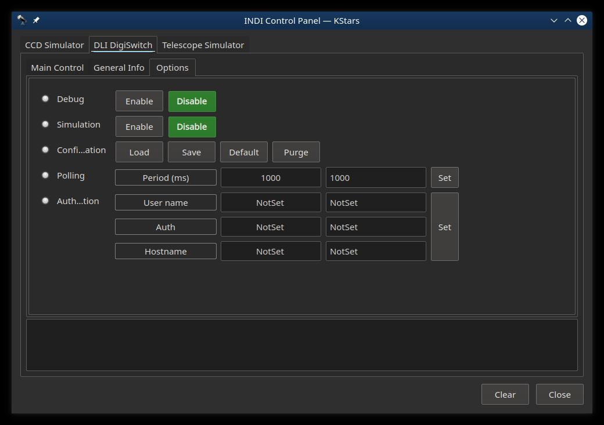
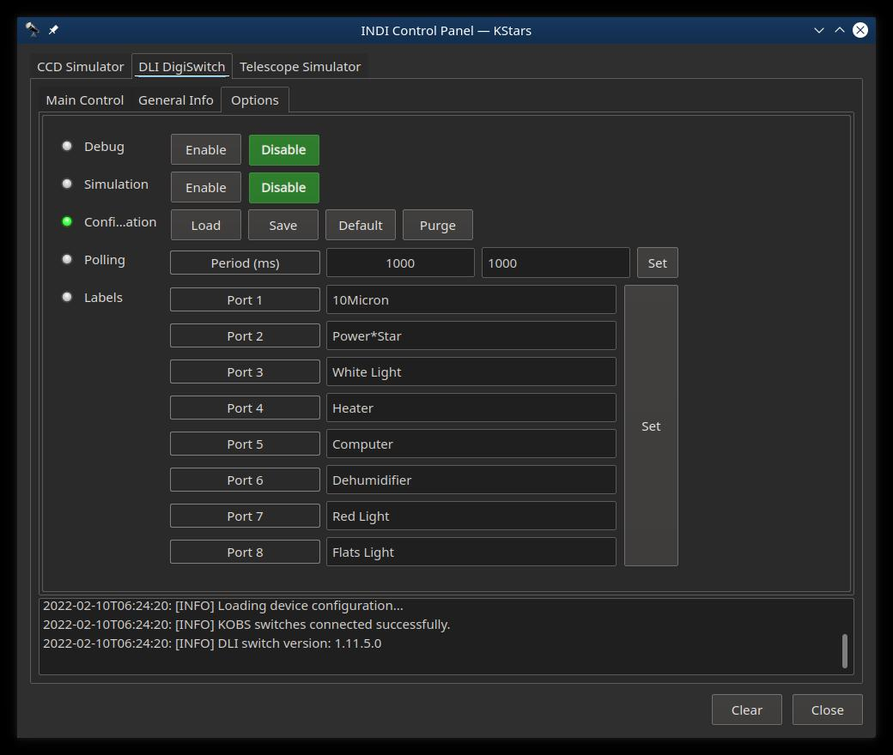
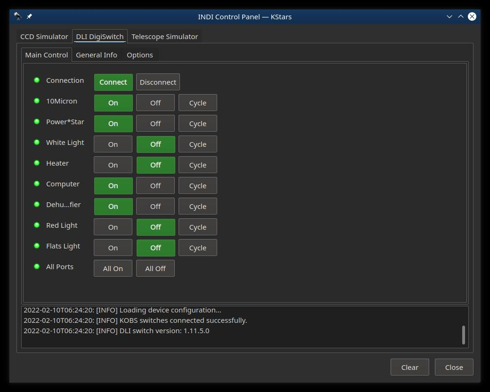
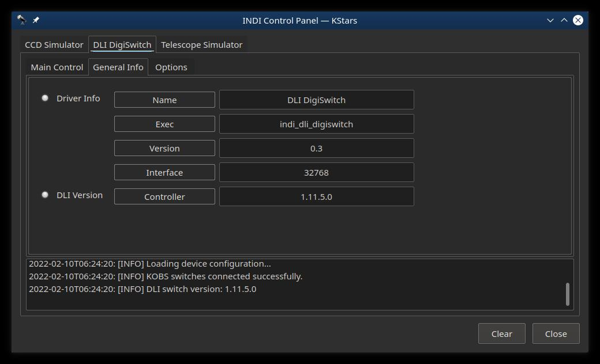

# DLI Digiswitch
INDI DLI switch driver

DLI Digiswitch INDI Driver
=========================================
This package provides the INDI driver for DLI's Digiswitch (Web Switch Pro):
- Rugged, reliable power control over the web. Industrial quality, 15A
- Secure web server with SSL, SSH, HTTPS, SNMP, REST API, MODBUS
- Amazon Echo/Alexis compatible
- Simple web UI, or write your own script or program
- AutoPing feature to reliably reboot routers or APs 

The DLI Digiswitch driver is compatible with libindi >= v1.8.2

NOTES
=====

- You need to setup the hostname and authentication in the Digiswitch before running this driver
- Initial power settings (when the Digiswitch is powered on) needs to be set in the Digiswitch
- Cycle time needs to be set in the Digiswitch
- Optionally you can set the port names as well (these can be changed with this INDI driver)

*Read the Release Notes*

INSTALL
=======
- Reference the INSTALL document.

FEATURES
========
- Control the power (on/off) for the 8 ports
- Cycle the power of a port (if it's turned on)
- Name ports

How to Use
==========

You can use the driver in any INDI-compatible client (such as KStars or Xephem) - just select 
DLI digiswitch from the Auxiliary list

To run the driver from the command line:

$ indiserver indi_dli_digiswitch # plus other needed drivers (telescope, camera, etc)

or using the indiwebserver.

You can then connect to the driver from any client, the default port is 7624.
If you're using KStars, the drivers will be automatically listed in KStars' Device Manager.

Before you Start
================

- You need to set the authentication parameters (user, password, hostname) under the 'Options' tab
  - These need to match what you setup in the DLI switch
  - After authentication, click on 'Connect' under the Main Tab
- Once successfully authenticated to the DLI switch, you can set the port names
- There is a slight delay between setting a switch and the indicator light
- (Add notes for DLI configuration)

OPERATIONS
==========

Options Tab (Unauthenticated)
-----------

First time access, you will need to set the user name, password and hostname of the DLI digiswitch.  

NOTE: you will need to click on the 'Connect' button on the Main Tab to continue.

Once authenticaled, the authentication fields will disappear and the port names fields will appear.

Options Tab (Authenticated)
-----------

After authenticating and connecting, the Options Tab will allow you to name/rename the ports.  This will rename them in the Digiswitch as well.

When the driver is started, it will retrieve these names from the Digiswitch.

Main Tab
--------

The Main Tab allows you to connect/disconnect from the Digiswitch as well as turn the ports on or off, or cycle the port if it is on.

The cycle time will be whatever is set in the Digiswitch.

This also allows you to turn all port on or off.

General Info Tab
----------------

Driver Info/Version is the version of this INDI driver
DLI Version is the firmware version reported by the Digiswitch

ISSUES
============
- Reference the Release Notes (above)

